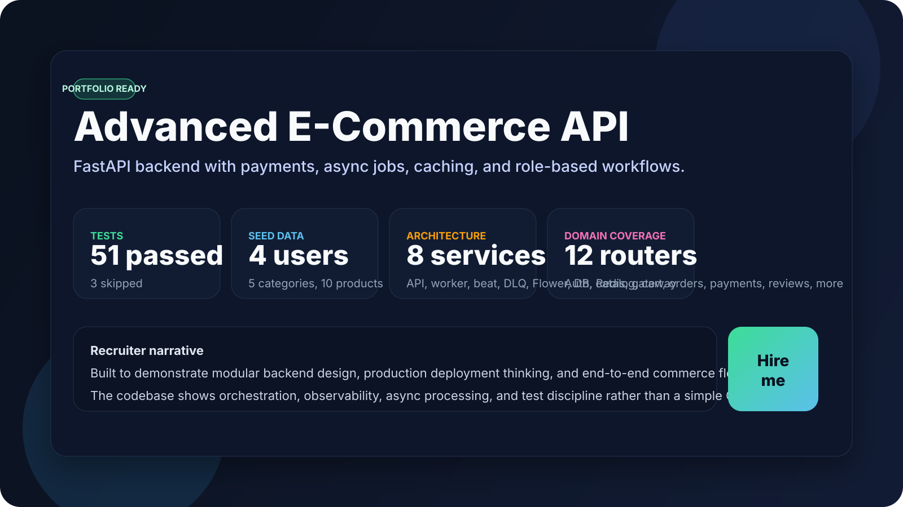
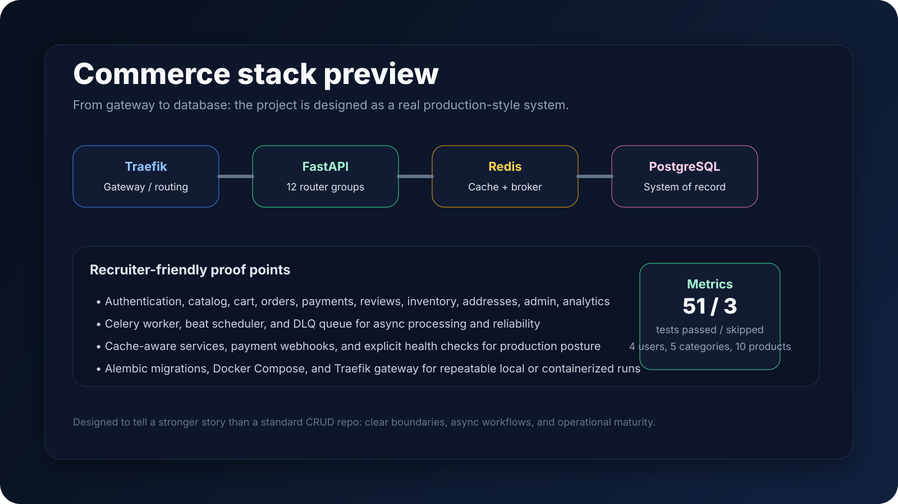
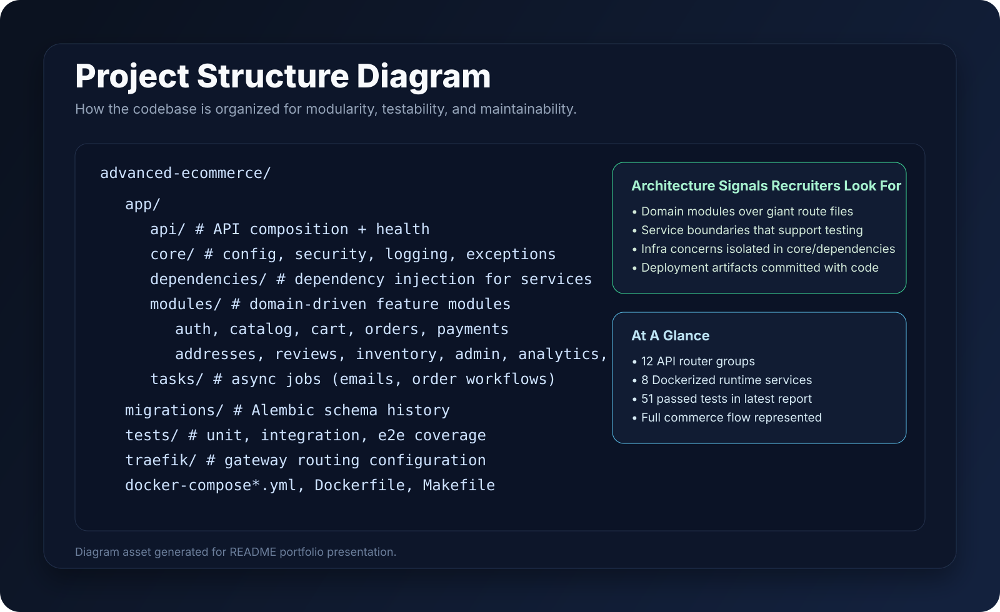

# Advanced E-Commerce API

Advanced E-Commerce API is a production-style backend that shows how I design and ship real commerce systems: modular, observable, testable, and ready for containerized deployment. It is built with FastAPI, PostgreSQL, Redis, Celery, and Traefik, and it covers the full transaction path from authentication to checkout, payment verification, shipping, reviews, and admin operations.

This repository is intentionally stronger than a CRUD sample. It demonstrates service boundaries, event-driven workflows, webhook handling, cache-aware reads, health checks, Docker orchestration, and a domain split that recruiters can scan in seconds and still trust.

## Recruiter Snapshot

| Metric                 | Value                                       |
| ---------------------- | ------------------------------------------- |
| Automated tests        | 51 passed, 3 skipped                        |
| Seeded demo data       | 4 users, 5 categories, 10 products          |
| Containerized services | 8 services in Docker Compose                |
| API coverage           | 12 router groups across the commerce domain |

## Visual Preview







## Why This Project Stands Out

- It tells a complete product story, not just a technical one: browse, cart, pay, fulfill, review, and administer.
- It uses a service layer and repository pattern so business rules stay isolated and testable.
- It includes real asynchronous behavior with Celery workers, beat scheduling, and a DLQ queue.
- It uses domain events and listeners to decouple checkout, payment, shipping, analytics, and notifications.
- It models payment initialization and webhook processing instead of hand-waving the hard part.
- It uses Redis for both caching and message brokering, which is the kind of tradeoff recruiters expect in production systems.
- It separates customer and admin flows with role-based access and dedicated modules.
- It is already wired for Docker-first deployment with Traefik, health checks, migrations, and seed data.
- It has verified tests that cover both unit and integration behavior.

## Tech Stack

- FastAPI
- PostgreSQL
- Redis
- Celery
- Flower
- SQLAlchemy
- Alembic
- Traefik
- Pydantic Settings
- Pytest
- Docker and Docker Compose

## Core Capabilities

- Authentication with access and refresh tokens
- Product and category management
- Cart creation, updates, and totals
- Inventory checks and stock reservation
- Checkout flow with payment hand-off
- Payment webhook processing
- Shipping addresses
- Product reviews with purchase validation
- Admin user and order management
- Analytics overview endpoint
- Structured logging and request tracing
- Database migrations and seed data
- Health checks for app and database

## Project Narrative

This project was built to answer a question recruiters care about: can this person design software that behaves well in the real world? The answer here is visible across the codebase. The API is split by domain instead of being centralized in a single file. Business logic lives in services, not controllers. Domain events are published at key lifecycle moments so checkout, payment, shipping, analytics, and notifications can evolve independently. Payment flows are verified instead of assumed. Caching is applied to hot paths. And the deployment story is realistic enough to run locally in Docker or inspect in a production-like compose stack.

If you are reviewing this as a hiring manager, the useful signal is not just that the app works. It is that the code shows judgment: clear boundaries, operational awareness, and a bias toward maintainable structure.

## Event-Driven Architecture

The application now uses an explicit domain event bus. The API and services publish events, and listeners fan those events out to payments, emails, analytics, and fulfillment.

```text
Checkout
    |
    v
OrderCheckoutInitiated
    |
    +--> Payment listener -> initialize payment session
    +--> Analytics listener -> increment checkout metrics

Payment success
    |
    v
PaymentSucceeded
    |
    +--> Email listener -> order confirmation + admin notification
    +--> Fulfillment listener -> auto-ship order when possible
    +--> Analytics listener -> increment payment metrics

Order shipped
    |
    v
OrderShipped
    |
    +--> Email listener -> shipping update email
    +--> Analytics listener -> increment shipping metrics

Async work
    |
    v
Celery queues -> email tasks, maintenance tasks, DLQ handling
```

## Interview Diagrams

### High-Level Architecture Diagram

```text
Customer / Admin / Recruiter
                             |
                             v
                Traefik Gateway
                             |
                             v
                FastAPI Application
            /    |     |      |      \
         v     v     v      v       v
     Auth  Catalog Cart  Orders  Payments
         |      |     |      |        |
         v      v     v      v        v
     PostgreSQL PostgreSQL PostgreSQL PostgreSQL Paystack API

Supporting services
-------------------
FastAPI -> Redis Cache / Broker -> Celery Worker -> Flower Monitoring
                                                             \-> Celery Beat

Other domain modules
--------------------
Addresses, Reviews, Inventory, Admin, Analytics
```

### Request Flow Diagram

```text
User -> API -> Service -> DB
             |
             v
         Queue -> Worker -> Notification
```

### Data Flow Diagram

```text
User Action
    |
    v
FastAPI Endpoint
    |
    v
Validation / Auth / Permissions
    |
    v
Domain Service
   /   |     \
  v    v      v
 Repo  Cache  Async Job
  |     |        |
  v     |        v
  DB    |    Celery Worker
        |        |
        |        v
        |   Email / Order Side Effects
        |        |
        |        v
        |       DB
        |
        v
Payment Gateway
        |
        v
Payment Webhook
        |
        v
Domain Service
```

### Sequence Diagram

```text
Customer
    |
    v
Traefik
    |
    v
FastAPI API
    |
    v
Order Service
    |
    +--> PostgreSQL: read cart, lock inventory, create order
    |
    +--> Redis: invalidate cart/order caches
    |
    +--> Paystack: initialize payment session
    |              |
    |              v
    |        Checkout URL + reference
    |
    v
Return checkout URL to customer

Paystack webhook
    |
    v
FastAPI API -> Order Service -> Celery Worker -> Notifications / email side effects
                              |
                              v
                     PostgreSQL updates
```

## Project Structure


```text
advanced-ecommerce/
├── app/
│   ├── api/            # API composition + health endpoints
│   ├── core/           # config, logging, security, exceptions
│   ├── dependencies/   # dependency providers for services/cache/db
│   ├── modules/        # domain modules
│   │   ├── auth/
│   │   ├── catalog/
│   │   ├── cart/
│   │   ├── orders/
│   │   ├── payments/
│   │   ├── addresses/
│   │   ├── reviews/
│   │   ├── inventory/
│   │   ├── admin/
│   │   └── analytics/
│   └── tasks/          # async jobs
├── migrations/         # Alembic versions and env
├── tests/              # unit, integration, e2e
├── traefik/            # gateway dynamic routing config
├── docker-compose.yml
├── docker-compose.dev.yml
├── Dockerfile
├── Makefile
└── README.md
```

- `app/main.py` - FastAPI app entrypoint, middleware, and exception handling
- `app/api/router.py` - central router composition
- `app/modules/*` - domain modules for auth, catalog, cart, orders, payments, reviews, inventory, addresses, admin, analytics, and users
- `app/dependencies/` - service and infrastructure dependency injection
- `app/core/` - configuration, logging, security, and exception primitives
- `app/tasks/` - Celery tasks for email and order workflows
- `migrations/` - Alembic migrations
- `tests/` - unit, integration, and end-to-end coverage
- `docker-compose.yml` - production-like stack with Traefik, API, worker, beat, Flower, PostgreSQL, and Redis
- `docker-compose.dev.yml` - local development overrides

## Quick Start

### Docker

```bash
docker compose up --build -d
```

Open these URLs:

- `http://localhost/api`
- `http://localhost/docs`
- `http://localhost/redoc`
- `http://localhost/openapi.json`
- `http://localhost:8080` for Traefik dashboard in dev mode

### Demo Credentials

- Customer 1: `customer1@example.com` / `CustomerPass123!`
- Customer 2: `customer2@example.com` / `CustomerPass456!`
- Test user: `testing@example.com` / `TestPass789!`

### Common Tasks

```bash
docker compose exec api alembic upgrade head
docker compose exec api python seed_database.py
docker compose logs -f --no-log-prefix
docker compose down
```

### Local Development

If you prefer running the app outside Docker, use the same environment variables from `.env` and start the API with Uvicorn.

```bash
uvicorn app.main:app --reload --host 0.0.0.0 --port 8000
```

## Useful Endpoints

- `GET /api/v1/health/db` - database health check
- `POST /api/v1/auth/register` - create a customer account
- `POST /api/v1/auth/login` - obtain access and refresh tokens
- `GET /api/v1/products` - list catalog products
- `GET /api/v1/categories` - list categories
- `POST /api/v1/cart/items` - add an item to the cart
- `POST /api/v1/orders/checkout` - create an order from the cart
- `POST /api/v1/payments/verify` - verify payment by reference
- `POST /api/v1/payments/webhook` - payment provider webhook receiver
- `GET /api/v1/admin/users` - admin user management
- `GET /api/v1/analytics/overview` - business metrics overview

## Evidence of Quality

- `51 passed, 3 skipped` from the test suite.
- `4` seeded users for role-based demos and recruiter walkthroughs.
- `5` product categories and `10` products for realistic commerce flows.
- `8` services in the container stack, including API, worker, beat, DLQ, Flower, database, Redis, and Traefik.
- `12` API router groups spanning the full commerce domain.

## Screenshots and Proof Points

The repository includes three visual preview assets in addition to the ASCII diagrams above. They are designed to make the README feel more like a portfolio landing page than a plain setup guide.

- [Recruiter hero preview](assets/recruiter-hero.svg)
- [Stack preview](assets/stack-preview.svg)
- [Project structure diagram](assets/project-structure-diagram.svg)

## Environment Variables

The app reads its configuration from `.env`.

Required values include:

- `DATABASE_URL`
- `SECRET_KEY`
- `MAIL_FROM`
- `RESEND_API_KEY`
- `PAYSTACK_SECRET_KEY`

Common optional values:

- `REDIS_URL`
- `CELERY_BROKER_URL`
- `CELERY_RESULT_BACKEND`
- `SENTRY_DSN`
- `SENTRY_ENVIRONMENT`

## Testing

Run the integration suite locally:

```bash
python -m pytest -q tests/integration
```

Run the full suite:

```bash
python -m pytest -q tests
```

## Deployment Notes

- Traefik is used as the gateway in Docker.
- PostgreSQL and Redis are containerized and networked with the API.
- Celery workers handle asynchronous email and order workflows.
- Health checks are defined for the app, database, and supporting services.
- Structured logs are enabled for easier debugging in local and production-like environments.
- The Docker stack includes an API service, background workers, a DLQ worker, beat scheduling, Flower monitoring, and a dedicated gateway.

## CI/CD

This repository uses GitHub Actions to validate changes and deploy by branch promotion:

- Pull requests to `develop`, `staging`, and `main` run the CI workflow.
- Merges or pushes to `develop` deploy to the Render development service.
- Merges or pushes to `staging` deploy to the Render staging service.
- Merges or pushes to `main` deploy to the Render production service after GitHub production approval.

Full setup, promotion flow, secrets, rollback, and troubleshooting notes live in [docs/ci-cd.md](docs/ci-cd.md).

## Demo Data

The repository includes a seed script that creates realistic demo data for:

- Admin and customer users
- Categories and products
- Inventory records
- Product images
- Shipping addresses
- Sample cart and order-related records

## What Hiring Managers Usually Notice

- Clear separation between API, service, repository, and infrastructure layers.
- Real workflow complexity: checkout, payment verification, webhooks, and async follow-up tasks.
- Production thinking: health checks, observability, caching, and container orchestration.
- Clean modularization that scales better than a monolithic routes file.

## License

This project is licensed under the MIT License. See the LICENSE file for details.
